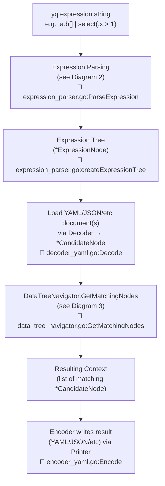
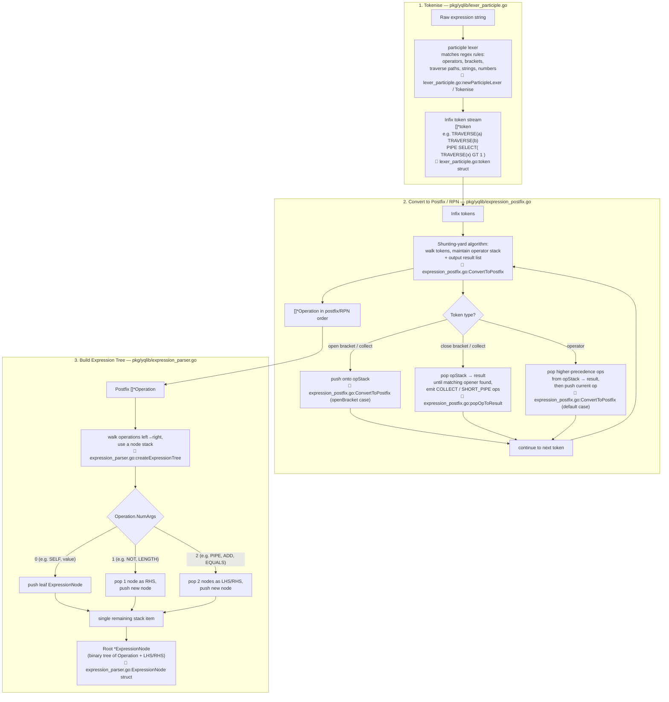
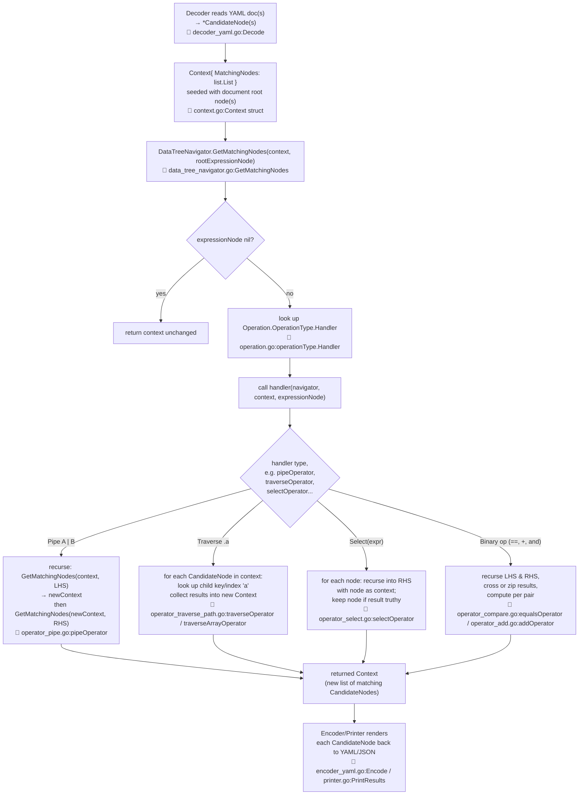
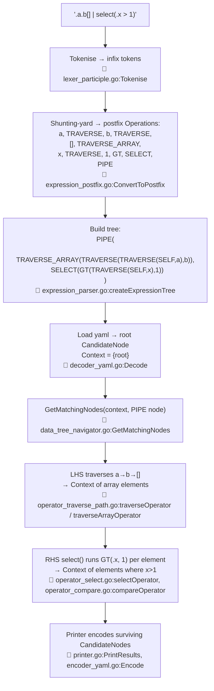

# yq Under the hood

## 1. High-level overview

- Every yq run turns a text expression into an `*ExpressionNode` tree exactly once, then reuses that tree against every input document.
- Documents are decoded into `*CandidateNode` trees, which is the same node type the expression tree operates on.
- `DataTreeNavigator.GetMatchingNodes` walks the expression tree against a `Context` of candidate nodes, producing a new `Context` of matches which the encoder then serialises.

## 2. Expression parsing sub-diagram (tokenising → RPN → tree)

- **Tokenise**: a participle-generated lexer converts the raw string into an ordered list of typed tokens (operators, brackets, path segments, literals).
- **Postfix (shunting-yard)**: tokens are reordered into Reverse Polish Notation using an operator stack, so operator precedence and bracket nesting are resolved before tree-building.
- **Tree build**: the postfix `Operation` list is walked once, using a node stack, popping 1 or 2 operands per operator to build a binary `*ExpressionNode` tree (unary ops just leave `LHS` nil).

Implemented in `pkg/yqlib/expression_parser.go`, `pkg/yqlib/lexer_participle.go`, `pkg/yqlib/expression_postfix.go`.

Key structs:
- `token` — raw lexed unit (bracket, operator, literal, path segment). Defined in [pkg/yqlib/lexer_participle.go](pkg/yqlib/lexer_participle.go).
- `Operation` — an `operationType` (e.g. `traverseOpType`, `pipeOpType`, `selectOpType`) plus preferences/value. Defined in [pkg/yqlib/operation.go](pkg/yqlib/operation.go).
- `ExpressionNode{Operation, LHS, RHS, Parent}` — the final AST, always binary (unary ops just leave LHS nil). Defined in [pkg/yqlib/expression_parser.go](pkg/yqlib/expression_parser.go).

## 3. Applying the expression tree to a YAML document

- Documents are decoded into `*CandidateNode`s and seeded into a `Context` (a `list.List` of matching nodes) — the starting point for evaluation.
- `GetMatchingNodes` is called recursively: each `ExpressionNode` looks up its `Operation`'s handler function and invokes it with the current `Context`.
- Handlers differ by operator: pipes chain two sub-evaluations, traversal looks up child keys/indices, `select` filters nodes, binary ops cross/zip and compare — each returning a new `Context` that feeds the next step.

Implemented in `pkg/yqlib/data_tree_navigator.go` and the various `operator_*.go` handler files, driven by `pkg/yqlib/stream_evaluator.go` or `pkg/yqlib/all_at_once_evaluator.go`.

## 4. End-to-end example: `.a.b[] | select(.x > 1)`

- Ties diagrams 2 and 3 together: the same expression is tokenised, converted to postfix, and built into a tree once.
- That tree is then evaluated against the loaded document by recursively descending through `PIPE` → traversal → `SELECT`.
- Only `CandidateNode`s surviving the `select` predicate reach the printer.

